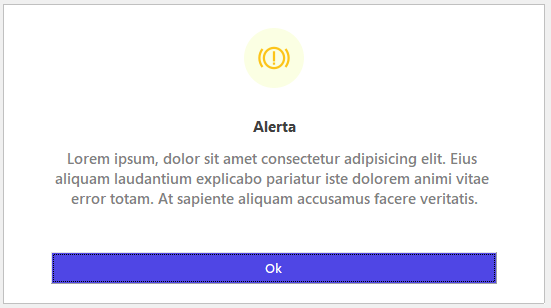
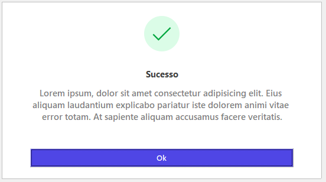
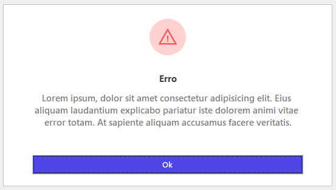
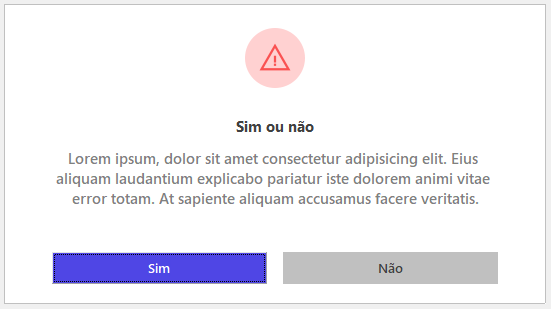
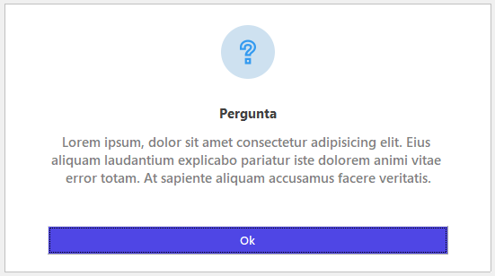
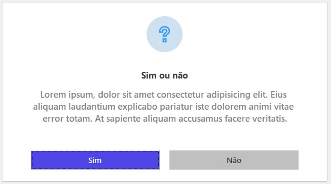

# 🖥️ Modal Dialog Moderno no VB6 – Estilo Tailwind CSS  

Este projeto ensina como criar um **modal dialog moderno** no **Visual Basic 6 (VB6)**, simulando a funcionalidade da `MsgBox`, mas com um **design profissional** inspirado no **Tailwind CSS**.  

## 📸 **Exemplos Visuais do Modal**  

### 🔴 **Modal de Alerta**  


### ✅ **Modal de Sucesso**  


### ❌ **Modal de Erro**  


### ⚠️ **Modal de Confirmação (Sim ou Não) - Erro**  


### ❓ **Modal de Interrogação**  


### ❓ **Modal de Confirmação (Sim ou Não) - Pergunta**  


## 🚀 **Recursos do Modal**  
✅ Interface moderna e limpa 📌  
✅ Substitui o MsgBox padrão do VB6  
✅ Fácil de personalizar (cores, ícones, botões) 🎨  
✅ Código simples e reutilizável 🔄  

## 📂 **Como Usar**  

1️⃣ **Baixe os arquivos do repositório**  
2️⃣ **Adicione o `ModalDialog` ao seu projeto**  
3️⃣ **Chame o modal sempre que precisar exibir uma mensagem** 

 **Obs: O modal simula uma MsgBox padrão do VB6, então é possível utilizar o mesmo padrão para passagem de parâmetros**  
### **Exemplo de Uso no Formulário**  

```vb
Private Sub cmdAbrirModal_Click()

  Const TextoGenerico = "Lorem ipsum, dolor sit amet consectetur adipisicing elit. Eius aliquam laudantium explicabo pariatur iste dolorem animi vitae error totam. At sapiente aliquam accusamus facere veritatis."

  'Exemplo MsgBox padrão do VB6
  MsgBox TextoGenerico, vbCritical, "Erro"
  'Exemplo MsgBoxRetro
  RetroMsgBox TextoGenerico, vbCritical, "Erro"

  'Outras combinações de exemplo
  RetroMsgBox TextoGenerico, vbInformation, "Sucesso"
  RetroMsgBox TextoGenerico, vbExclamation, "Alerta"
  RetroMsgBox TextoGenerico, vbQuestion, "Pergunta"
  RetroMsgBox TextoGenerico, vbYesNo + vbQuestion, "Sim ou não"
  RetroMsgBox TextoGenerico, vbCritical + vbYesNo + vbDefaultButton2, "Sim ou não"

End Sub
